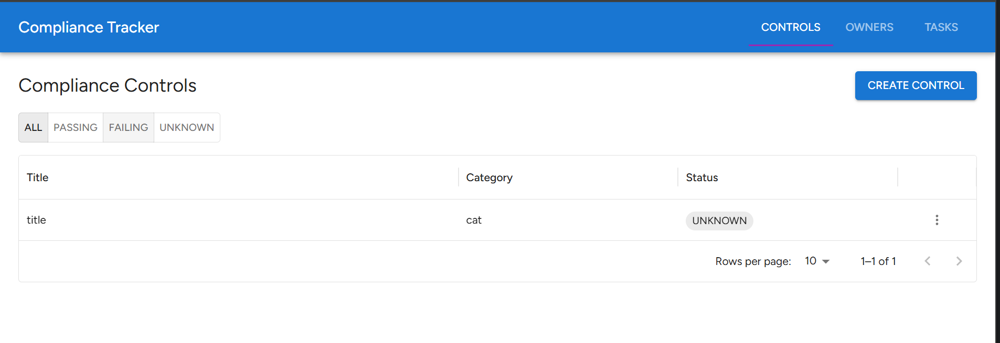

# GraphQL Compliance Tracker

A full-stack compliance task tracking application demonstrating production-quality GraphQL patterns. Built with Apollo
Server 4, React, and MongoDB.



> _Controls dashboard with status filtering and task drawer_

---

## Stack

| Layer       | Technology                                       |
| ----------- | ------------------------------------------------ |
| Frontend    | React 18 + TypeScript + Apollo Client 3 + MUI v7 |
| Backend     | Node.js + TypeScript + Apollo Server 4 + Express |
| Database    | MongoDB 7 + Mongoose 8                           |
| Testing     | Jest + React Testing Library                     |
| Dev tooling | Vite + GraphQL Code Generator + ts-jest          |

---

## GraphQL Depth Signals

Four patterns that go beyond basic CRUD:

### 1. DataLoader — N+1 prevention

Every `Task` has an `owner` field that resolves to an `Owner` document. Naively, fetching 50 tasks would fire 50
separate `Owner.findById()` calls. Instead, a `DataLoader` instance created per request batches all owner IDs from a
single request cycle into one `Owner.find({ _id: { $in: ids } })` call.

```ts
// server/src/dataloaders/ownerLoader.ts
export function createOwnerLoader() {
  return new DataLoader<string, IOwner | null>(async (ids) => {
    const owners = await Owner.find({ _id: { $in: ids } }).exec();
    const map = Object.fromEntries(owners.map((o) => [o._id.toString(), o]));
    return ids.map((id) => map[id] ?? null);
  });
}
```

The loader is instantiated per request in Apollo's context factory — ensuring batching is scoped to a single request,
not shared across users.

### 2. Custom scalar — `DateTime`

Rather than passing dates as plain strings, `DateTime` is a proper GraphQL scalar with `serialize`, `parseValue`, and
`parseLiteral` implementations. This enforces ISO 8601 format at the schema boundary and converts to/from JavaScript
`Date` objects in resolvers.

```ts
// server/src/schema/scalars.ts
export const DateTimeScalar = new GraphQLScalarType({
  name: 'DateTime',
  serialize: (value) => (value instanceof Date ? value.toISOString() : String(value)),
  parseValue: (value) => new Date(String(value)),
  parseLiteral: (ast) => (ast.kind === Kind.STRING ? new Date(ast.value) : null),
});
```

### 3. Input types — named mutation inputs

All mutations accept named input types rather than bare arguments. This keeps the schema self-documenting, makes client
code readable, and allows input fields to evolve independently.

```graphql
input CreateTaskInput {
  controlId: ID!
  ownerId: ID!
  dueDate: DateTime!
  notes: String
}

type Mutation {
  createTask(input: CreateTaskInput!): Task!
}
```

### 4. Enum type — `ControlStatus`

Control status is a proper GraphQL enum, not a free-form string. The schema rejects any value outside
`PASSING | FAILING | UNKNOWN` at the protocol layer before it reaches a resolver.

```graphql
enum ControlStatus {
  PASSING
  FAILING
  UNKNOWN
}
```

---

## Project Structure

```
compliance-tracker/
├── client/                        # React + Vite frontend
│   ├── src/
│   │   ├── apollo/                # ApolloClient setup
│   │   ├── components/            # ControlsDashboard, TaskDrawer, StatusBadge
│   │   └── graphql/
│   │       ├── queries.graphql
│   │       ├── mutations.graphql
│   │       └── __generated__/     # Types + hooks from GraphQL Code Generator
│   ├── codegen.ts
│   └── jest.config.ts
├── server/
│   ├── src/
│   │   ├── schema/                # schema.graphql + scalars
│   │   ├── resolvers/             # Query + Mutation resolvers
│   │   ├── models/                # Mongoose models
│   │   ├── dataloaders/           # Per-request DataLoader instances
│   │   └── index.ts
│   └── jest.config.ts
├── docker-compose.yml
└── PLAN.md
```

---

## Prerequisites

- Node.js 18+
- Docker Desktop (for MongoDB)

---

## Setup

### 1. Start MongoDB

```bash
docker compose up -d
```

### 2. Server

```bash
cd server
npm install
npm run setup      # creates server/.env.local from .env.local.dist
npm run dev        # starts Apollo Server on http://localhost:4000/graphql
```

### 3. Client

```bash
cd client
npm install
npm run setup      # creates client/.env.local from .env.local.dist
npm run dev        # starts Vite dev server on http://localhost:5173
```

### Environment variables

Both packages ship a `.env.local.dist` template that `npm run setup` copies to `.env.local` (gitignored).

| Package | Variable           | Default                                        |
| ------- | ------------------ | ---------------------------------------------- |
| server  | `MONGODB_URI`      | `mongodb://localhost:27017/compliance-tracker` |
| server  | `PORT`             | `4000`                                         |
| client  | `VITE_GRAPHQL_URI` | `http://localhost:4000/graphql`                |

---

## GraphQL Code Generator

Types and React hooks are generated from the server's SDL — no manual type duplication.

```bash
cd client
npm run codegen    # regenerate after schema or query changes
```

Generated output lives in `client/src/graphql/__generated__/types.ts` and is committed so the repo compiles without
running codegen first.

---

## Tests

```bash
# Server (resolver unit tests)
cd server && npm test

# Client (component tests)
cd client && npm test
```

**Server tests** (`server/src/resolvers/resolvers.test.ts`):

- `updateControlStatus` — returns correct shape; handles not-found
- `tasksByControl` — filters correctly by controlId
- `createTask` — handles missing owner; handles missing control

**Client tests**:

- `StatusBadge` — renders correct MUI Chip color per status (PASSING / FAILING / UNKNOWN)
- `TaskDrawer` — renders task notes and owner name after query resolves; renders due date; hides when no controlId

---

## Apollo Sandbox

With the server running, open [http://localhost:4000/graphql](http://localhost:4000/graphql) to explore the schema and
run queries interactively.

Example query showing nested resolution and the DataLoader in action:

```graphql
query {
  tasksByControl(controlId: "<id>") {
    id
    dueDate
    notes
    completed
    owner {
      name
      email
    }
    control {
      title
      status
    }
  }
}
```
